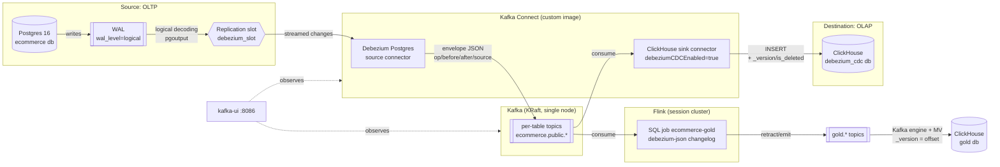

# Postgres → ClickHouse CDC with Debezium + Kafka Connect

A local, reproducible change-data-capture pipeline: the same
e-commerce-shaped Postgres OLTP database as
[`stream-cdc-peerdb`](../stream-cdc-peerdb) streams inserts/updates/deletes
into ClickHouse in near real-time, this time via
[Debezium](https://debezium.io/)'s Postgres connector, Kafka, and the
official [ClickHouse Kafka Connect sink connector](https://github.com/ClickHouse/clickhouse-kafka-connect)
— assembled by hand from general-purpose parts, instead of PeerDB's single
purpose-built product.

## About this project

This is the other half of a comparison, not a standalone tutorial.
[`stream-cdc-peerdb`](../stream-cdc-peerdb) solves the identical problem
— same schema, same seed data, same ClickHouse destination — via PeerDB,
and its README argues for that choice against Debezium+Kafka Connect on
paper. This repo builds the Debezium+Kafka Connect side for real, so the
comparison is evidence, not assertion, on both sides. Same three pillars:

1. **A tool-selection decision with real tradeoffs stated** — see
   [Why Debezium + Kafka Connect](#why-debezium--kafka-connect-and-not-peerdb).
2. **Evidence over assertion.** Every specific claim below (row counts,
   propagation timing, failure behavior, exact grant sets, and — critically
   — two places where my initial design assumption turned out to be wrong)
   was reproduced against this project's own running stack — see
   [What this actually proves](#what-this-actually-proves).
3. **Named limitations, not implied completeness** — see
   [Production considerations](#production-considerations-what-id-change-for-real).

**If you have two minutes:** read this section, then
[Why Debezium + Kafka Connect](#why-debezium--kafka-connect-and-not-peerdb)
and [What this actually proves](#what-this-actually-proves).
**If you're doing technical diligence:** `make up && make verify`
reproduces the whole thing; every technical claim links to the exact
script or doc section that proves it.

### Competencies this demonstrates

| Area | Where |
|---|---|
| Tool/architecture selection under real tradeoffs (not just implementation) | [Why Debezium + Kafka Connect](#why-debezium--kafka-connect-and-not-peerdb) |
| Assembling a CDC pipeline from independently-versioned parts (source connector, broker, sink connector) rather than one product | [What's running](#whats-running-and-why-its-shaped-this-way), [`kafka-connect/Dockerfile`](kafka-connect/Dockerfile) |
| Reading a connector's own source to verify behavior instead of assuming from docs | [Debezium's envelope → ClickHouse](docs/architecture.md#debeziums-envelope--clickhouse-no-hand-rolled-flattening-needed) |
| Operational maturity — monitoring, alerting signals, failure injection with evidence | [Stage 4](#stage-4-operations-monitoring-schema-evolution-failure-recovery) |
| Security by default (least-privilege access, credential separation) | [ClickHouse configuration](#clickhouse-configuration) |
| Data-integrity edge cases found by testing, both with a feature off and on | [schema evolution findings](docs/architecture.md#schema-evolution--tested-both-ways-not-assumed) |
| Streaming aggregation over a CDC changelog (retractions, joins, deletes) instead of insert-only MVs | [Streaming gold layer](#streaming-gold-layer-flink) |
| Honest scope framing — naming what isn't production-ready | [Production considerations](#production-considerations-what-id-change-for-real) |

See [`docs/architecture.md`](docs/architecture.md) for the full mechanics,
a data-flow diagram, and every failure-mode finding in detail.

**Contents:** [About](#about-this-project) ·
[Why Debezium + Kafka Connect](#why-debezium--kafka-connect-and-not-peerdb) ·
[Results](#what-this-actually-proves) ·
[Quickstart](#quickstart) ·
[What's running](#whats-running-and-why-its-shaped-this-way) ·
[Registering connectors](#stage-3-registering-the-connectors) ·
[Operations](#stage-4-operations-monitoring-schema-evolution-failure-recovery) ·
[Production considerations](#production-considerations-what-id-change-for-real) ·
[Repo layout](#repo-layout)

## Why Debezium + Kafka Connect (and not PeerDB)

This is the inverse of the table in `stream-cdc-peerdb`'s README — same
honest-tradeoffs framing, argued from the other side:

| Consideration | Debezium + Kafka Connect (this repo) | PeerDB (`stream-cdc-peerdb`) |
|---|---|---|
| **What it actually is** | Log-based CDC into Kafka topics, decoupled from any one sink by a durable, replayable event log | Purpose-built Postgres↔ClickHouse CDC shipping its own orchestration (Temporal) |
| **When it's the right call** | **Multiple heterogeneous consumers** need the same change stream — a warehouse, a search index, a cache invalidator, an event-driven service. Kafka's replay and fan-out are the entire point, and this setup is one new sink connector away from adding a second consumer without touching the source connector at all. | One sink, and the priority is understanding/testing internals rather than assembling infrastructure that mostly sits idle for a single-consumer workload. |
| **Operational surface, measured not guessed** | 5 containers for the CDC path itself (Kafka, Kafka Connect, kafka-ui, source, destination), one of which (`kafka-connect`) is a custom-built image combining two independently-versioned connectors — see [`kafka-connect/Dockerfile`](kafka-connect/Dockerfile). Plus 2 Flink containers for the optional gold layer, which a single-sink pipeline doesn't need. | 11 containers (per `stream-cdc-peerdb`'s README), but all vendored as PeerDB's own unmodified control plane — one product, not an assembly. |
| **Schema management** | Fully manual: destination DDL is hand-written ([`clickhouse/init/02_destination_tables.sql`](clickhouse/init/02_destination_tables.sql)), and automatic `ADD COLUMN` propagation (`auto.evolve=true`, enabled here) needed an extra grant *and* a tombstone filter to work — [tested both ways](docs/architecture.md#schema-evolution--tested-both-ways-not-assumed). Renames/drops still manual. | Automatic: PeerDB generates destination DDL from the source table and propagates `ADD COLUMN` by default. |
| **What's genuinely open source, no per-row metering** | Debezium, Kafka, and the ClickHouse sink connector are all Apache-2.0/open source. | PeerDB OSS, also open source and self-hostable. |
| **Honest cost of this repo's specific choices** | No schema registry/Avro (JSON with embedded schema instead) — a real size/throughput tradeoff, named in Production considerations, not hidden. Debugging surface spans three independently-operated systems (Postgres, Kafka Connect, ClickHouse) instead of one. | Smaller, younger project than Debezium/Kafka, smaller community, less multi-decade track record — `stream-cdc-peerdb`'s own named tradeoff. |

**The honest summary**: neither README's argument was wrong. For *this*
specific problem — one source, one sink — PeerDB's integrated approach
does less incidental work for the same result, which is exactly what
`stream-cdc-peerdb` claimed. Debezium+Kafka Connect earns its complexity
back the moment a second consumer shows up. The
[Flink gold layer](#streaming-gold-layer-flink) is that second consumer:
it was added without touching the source connector or the ClickHouse
sink. The schema-evolution and worker-recovery findings below show
concretely *where* that extra assembly cost actually shows up in practice,
not just in principle.

## What this actually proves

Everything below was run against this project's own stack, including two
places where my own design assumption was wrong going in and testing
caught it:

- **Initial snapshot**: 6 tables, exact row-count match between Postgres
  and ClickHouse immediately after registering both connectors.
- **Live CDC**: an insert, update, and delete against `source-postgres`
  each land in ClickHouse within one poll cycle — see
  `scripts/verify_cdc.sh`.
- **The ClickHouse sink connector didn't need a hand-rolled flattening
  transform.** The original design assumed one would (mirroring how a
  generic JDBC sink typically works). Reading the connector's own source
  showed it has a native Debezium CDC mode (`debeziumCDCEnabled=true`)
  that consumes the raw envelope directly and injects `_version` (from the
  Postgres WAL LSN) and `is_deleted` — a cleaner design than the original
  plan, adopted after verifying it against the connector's actual code,
  not its marketing docs. See
  [docs/architecture.md](docs/architecture.md#debeziums-envelope--clickhouse-no-hand-rolled-flattening-needed).
- **Schema evolution, tested both off and on**: with `auto.evolve=false`
  (this pipeline's default), an added source column is silently dropped —
  no error, task stays healthy, easy to miss. With `auto.evolve=true`, the
  connector genuinely does run `ALTER TABLE ... ADD COLUMN` automatically,
  matching PeerDB — but the first attempt failed loudly on a missing
  ClickHouse grant, and data dropped before enabling it stayed
  permanently lost even after fixing the grant. Once it was the default,
  a third problem surfaced: Debezium's delete tombstones made the sink
  task fail (`auto.evolve` checks the schema of only the last record in a
  batch). A tombstone filter fixed it. Now on by default and checked by
  `verify_cdc.sh` on every run. Full writeup in `docs/architecture.md`.
- **Failure recovery**: hard-killing `kafka-connect` mid-batch (2,000 rows
  in flight) recovered with the exact row count — no loss, no
  duplicates — once the container came back, and both connectors resumed
  automatically without re-registration (their config lives in a
  Kafka-backed topic, not a one-time script run). Same Docker gotcha as
  `stream-cdc-peerdb`: `restart: unless-stopped` does not fire on
  `docker kill`.
- **Pausing the source connector measurably grows the source's retained
  WAL** (~506 kB → ~629 kB after 500 rows while paused) — same physical
  mechanism `stream-cdc-peerdb` demonstrated for PeerDB. A subtlety this
  test surfaced that the PeerDB test didn't need to: the reported slot size
  stayed flat for a full 10 minutes after resuming — across two forced
  `CHECKPOINT`s and past Kafka Connect's offset-flush interval — and only
  drained (629 kB → 17 kB, instantly) once one more trivial write hit the
  otherwise-idle source. A logical slot's `restart_lsn` needs a fresh
  `xl_running_xacts` WAL record to compute a new restart candidate;
  confirmation + checkpoints alone aren't sufficient on a quiet source.
- **A streaming gold layer that stays exactly equal to the source.**
  A Flink SQL job reads the same Debezium topics as a second consumer
  and maintains three aggregates (daily revenue, revenue per category,
  customer lifetime value) in ClickHouse. `verify_cdc.sh` recomputes each
  one in Postgres and requires a row-for-row match after an order
  cancellation, an item delete, and a customer moving country. Postgres
  `UPDATE` to changed gold row: 1.4–2.5s. Gold stayed correct through a
  killed Flink taskmanager (restored from checkpoint) and a cancelled and
  resubmitted job (full replay). Getting there needed `REPLICA IDENTITY
  FULL` on the source; without it, Flink can't retract an update. See
  [Streaming gold layer](#streaming-gold-layer-flink).
- **The ClickHouse sink connector runs under a least-privilege user**, not
  a shared admin credential — `INSERT, SELECT`, plus `ALTER ADD COLUMN`
  for `auto.evolve` (the same grant PeerDB's own docs require), all
  scoped to `debezium_cdc`. No drop, modify, or create.

## Status

- [x] Stage 1 — Architecture
- [x] Stage 2 — Minimal setup
- [x] Stage 3 — Registering connectors, verifying insert/update/delete flow
- [x] Stage 4 — Monitoring, schema evolution (both modes), failure
      recovery, WAL retention
- [x] Stage 5 — Streaming gold layer (Flink), verified against Postgres

## Prerequisites

- Docker + Docker Compose v2 (`docker compose version`)
- ~5 GB free RAM for the stack (7 containers: Kafka, Kafka Connect,
  kafka-ui, source Postgres, ClickHouse, Flink jobmanager + taskmanager)
- Ports free on the host: `5433, 8124, 9010, 9094, 8087, 8086, 8088` — all
  chosen to avoid every port `stream-cdc-peerdb` uses, so **both stacks
  can run at the same time** for a direct side-by-side comparison

## Quickstart

```bash
make up       # starts everything, registers connectors, deploys the gold layer
make verify   # row counts, live insert/update/delete, gold vs. Postgres
```

That's it. `make up` starts the full stack (Kafka, Kafka Connect,
Postgres, ClickHouse, kafka-ui, Flink), waits for Kafka Connect to become
healthy, registers both connectors, and deploys the Flink gold job
(`make gold` on its own is idempotent). `make verify` runs the end-to-end
CDC verification.

First run pulls Kafka, Kafka Connect's base image, ClickHouse, and
Postgres, and builds the custom `kafka-connect` image (downloads the
ClickHouse sink connector plugin) — expect a few minutes depending on
your connection.

Other useful targets:

```bash
make status   # connector/task + Flink job status, consumer lag, WAL retention, row counts
make logs     # tail all service logs
make down     # stop, keep data volumes
make reset    # stop and wipe all state (full rebuild on next make up)
```

## Architecture



See [`docs/architecture.md`](docs/architecture.md) for the full mechanics,
failure-mode findings, and every design decision in detail.

---

## What's running, and why it's shaped this way

| Service | Role | Host port(s) |
|---|---|---|
| `dbz-kafka` | Single-node Kafka broker, KRaft mode (no ZooKeeper) | `9094` (external listener) |
| `dbz-kafka-connect` | Custom image: Debezium's Connect image + the ClickHouse sink connector plugin (`kafka-connect/Dockerfile`) | `8087` (REST API) |
| `dbz-kafka-ui` | Topics, consumer lag, connector/task status in one dashboard | `8086` |
| `dbz-source-postgres` | The OLTP source being captured — same schema as `stream-cdc-peerdb` | `5433` |
| `dbz-clickhouse` | The OLAP destination (`debezium_cdc` silver tables, `gold` aggregates) | `8124` (HTTP), `9010` (native) |
| `dbz-flink-jobmanager` / `dbz-flink-taskmanager` | Flink session cluster running the gold SQL job (`flink/Dockerfile` adds the Kafka connector) | `8088` (web UI + REST) |

Full mechanics, including *why* the ClickHouse sink connector doesn't need
a flattening transform and the KRaft env var setup, are in
[`docs/architecture.md`](docs/architecture.md).

### Source Postgres configuration

Same three `wal_level=logical` / `max_wal_senders` / `max_replication_slots`
flags as `stream-cdc-peerdb`, same reasoning. `postgres/init/01_schema.sql`
creates an explicit publication:

```sql
CREATE PUBLICATION dbz_pub FOR TABLE
    categories, customers, products, orders, order_items, payments;
```

`publication.autocreate.mode=disabled` in
`connectors/pg-source-connector.json` means the Debezium connector refuses
to start rather than creating a broader publication of its own if this one
is missing.

### ClickHouse configuration

Same least-privilege pattern as `stream-cdc-peerdb`: a bootstrap `ch_admin`
user (`CLICKHOUSE_DEFAULT_ACCESS_MANAGEMENT=1`) used only to provision a
scoped `clickhouse_etl` user
([`clickhouse/init/01_clickhouse_etl_user.sh`](clickhouse/init/01_clickhouse_etl_user.sh)),
which is what the sink connector actually authenticates as:

```sql
GRANT INSERT, SELECT, ALTER ADD COLUMN ON debezium_cdc.* TO clickhouse_etl;
```

Deliberately narrower than PeerDB's grant set — this connector never runs
`CREATE TABLE`. `ALTER ADD COLUMN` is there because `auto.evolve=true` is
on (see the schema-evolution findings above). Destination tables
are pre-created by hand in
[`clickhouse/init/02_destination_tables.sql`](clickhouse/init/02_destination_tables.sql)
— unlike PeerDB, the sink connector never creates a table that doesn't
already exist.

## Stage 3: registering the connectors

Kafka Connect's REST API (`localhost:8087`) is the equivalent of PeerDB's
`CREATE MIRROR` — both connector configs are checked-in JSON
(`connectors/pg-source-connector.json`,
`connectors/ch-sink-connector.json`), applied by:

```bash
./scripts/register_connectors.sh
```

This `PUT`s each config to `/connectors/<name>/config`, which is
idempotent (creates or updates in place) — same re-runnable-script
discipline as `stream-cdc-peerdb`'s `create_mirror.sh`. It waits for the
REST API to become reachable, registers both connectors, and prints their
status.

### Verifying the pipeline

```bash
./scripts/verify_cdc.sh
```

Same shape as `stream-cdc-peerdb`'s script: row-count comparison, then a
live insert/update/delete against the source polled against ClickHouse
(up to 60s). Sample output from an actual run:

```
== Step 1: row counts, source vs. ClickHouse (FINAL, excluding soft-deletes) ==
  categories     source=5      clickhouse=5      OK
  customers      source=15     clickhouse=15     OK
  products       source=20     clickhouse=20     OK
  orders         source=30     clickhouse=30     OK
  order_items    source=35     clickhouse=35     OK
  payments       source=30     clickhouse=30     OK

== Step 2: live CDC test (insert / update / delete) ==
  insert propagated: yes
  update propagated: yes
  delete propagated (soft-delete tombstone): yes

== Step 3: schema evolution (auto.evolve) -- a new source column reaches ClickHouse ==
  ALTER TABLE products ADD COLUMN IF NOT EXISTS weight_grams INTEGER; setting product_id=1 to 95745...
  polling ClickHouse for the new column and value (up to 60s)...
  new column propagated: yes (ClickHouse added weight_grams Nullable(Int32), value 95745)

== Step 4: gold layer (Flink) matches the same aggregates computed in Postgres ==
  toggling customers.customer_id=4 country (US <-> CA)...
  polling gold tables until they match Postgres (up to 60s)...
  gold.daily_revenue      22 rows, identical to Postgres  OK
  gold.category_revenue    5 rows, identical to Postgres  OK
  gold.customer_ltv       15 rows, identical to Postgres  OK
  gold converged within ~2s of the last source change.

CDC verification PASSED.
```

**The same gotcha as `stream-cdc-peerdb` applies here**: deletes are a
soft-delete tombstone (`is_deleted`), not a physical `DELETE`, because
`ReplacingMergeTree`'s merge-time dedup can't delete a single row out of an
existing part. Every query against a mirrored table needs:

```sql
SELECT * FROM debezium_cdc.order_items FINAL WHERE is_deleted = 0;
```

### Watching it work

- **kafka-ui** (`localhost:8086`) — topics, per-partition offsets/lag, and
  both connectors' task status in one place.
- **`scripts/connector_status.sh`** — the CLI equivalent: connector/task
  status via the Connect REST API, consumer lag via
  `kafka-consumer-groups.sh --describe`, replication slot size via
  `pg_replication_slots`, and current row counts in ClickHouse. Three
  different systems queried directly, where `stream-cdc-peerdb`'s
  `mirror_status.sh` queries one (`peerdb_stats`) — a concrete
  illustration of the "one product vs. assembled parts" tradeoff from the
  comparison table above.

## Streaming gold layer (Flink)

`debezium_cdc.*` mirrors the source tables (silver). The `gold` database
holds business aggregates kept current by a Flink SQL job
([`flink/sql/gold.sql`](flink/sql/gold.sql)):

| Table | Grain | What changes it |
|---|---|---|
| `gold.daily_revenue` | order day (UTC) | new/cancelled orders |
| `gold.category_revenue` | category | line items added/deleted, orders cancelled, products recategorised, categories renamed |
| `gold.customer_ltv` | customer | orders, plus the customer's own email/country |

```sql
SELECT * FROM gold.customer_ltv FINAL ORDER BY lifetime_value_cents DESC;
```

`FINAL` is all you need: retracted rows are hidden by
`ReplacingMergeTree(_version, is_deleted)`.

**Why Flink rather than a ClickHouse materialized view:** an MV only
sees inserted rows, so on CDC data it counts every update again, never
subtracts a delete, and ignores changes to the right-hand side of a
join. Flink reads Debezium's topics as a changelog (each update is a
retraction of the old row plus the new row) and corrects its aggregates
and joins to match. Kafka is what makes this cheap to add. Flink is a
second consumer of topics that already exist, and neither the source
connector nor the ClickHouse sink changed.

The path: Debezium topics → Flink → `gold.*` topics (debezium-json) →
ClickHouse Kafka engine + MV → `gold.*` tables, using the Kafka offset as
the row version. Why each of those choices was made (including
`REPLICA IDENTITY FULL` on the source), the failure tests, and the
limits are in
[`docs/architecture.md`](docs/architecture.md#streaming-gold-layer-flink).
Flink UI: `localhost:8088`.

## Stage 4: operations (monitoring, schema evolution, failure recovery)

Full detail, evidence, and exact reproduction commands for everything below
are in
[`docs/architecture.md`](docs/architecture.md#failure-modes-and-recovery-tested-against-this-projects-live-stack).

### Schema evolution

Tested with the feature both off and on, not assumed either way:

- **`auto.evolve=false`** (the original default): an added source
  column is silently dropped for any row synced while the destination
  table doesn't have it — no error, connector task stays `RUNNING`.
- **`auto.evolve=true`** (the default now): the connector runs `ALTER
  TABLE ... ADD COLUMN` automatically, genuinely matching PeerDB. It
  needs the `ALTER ADD COLUMN` grant (the task fails loudly without it),
  and it needs Debezium's delete tombstones filtered out of the sink. A
  batch ending on a tombstone fails the task, because only the last
  record's schema is checked.
- **Still not automatic**: renamed or dropped source columns.

### Failure and recovery

- **A paused source connector doesn't degrade gracefully on the source**
  — the replication slot retains WAL until it's consumed, identical
  mechanism to PeerDB. Measured: ~506 kB → ~629 kB retained after 500 rows
  written while paused, and it stayed elevated for 10+ minutes after
  resuming on this otherwise-idle source until one more small write let
  Postgres compute a new restart position — see `docs/architecture.md`
  for the mechanism.
- **A hard-killed `kafka-connect` recovers with exact data integrity** — a
  2,000-row insert issued right as the container was `SIGKILL`'d landed at
  exactly the expected count once it came back, no loss or duplication,
  and both connectors resumed on their own.
- **`restart: unless-stopped` did not auto-restart the killed
  container** — same Docker behavior `stream-cdc-peerdb` found: `docker
  kill` is treated as intentional operator action, not a crash.

### ClickHouse table engine choice

Same `ReplacingMergeTree(_version)` reasoning as `stream-cdc-peerdb` — see
[`docs/architecture.md`](docs/architecture.md#clickhouse-table-engine-choice-why-replacingmergetree)
for the full comparison against `MergeTree`/`CollapsingMergeTree`/
`AggregatingMergeTree`.

## Production considerations (what I'd change for real)

- **No TLS anywhere** — Kafka's PLAINTEXT listeners, the ClickHouse native
  protocol, and every inter-service connection run unencrypted. Acceptable
  on a single Docker network on localhost; not acceptable across any real
  network boundary.
- **No schema registry / no Avro** — both connectors ship the full schema
  embedded in every JSON message (`schemas.enable=true`), rather than a
  compact Avro payload with a schema registry doing compatibility
  checking. A real production Debezium+Kafka deployment would very likely
  use Avro+Schema Registry; skipped here specifically to control scope for
  this project's Postgres→ClickHouse comparison, not because it doesn't
  matter — named explicitly rather than glossed over.
- **`auto.evolve` only covers added columns** — a source column rename
  or drop still needs a coordinated migration (pause connectors, alter
  the destination DDL by hand, resume). That's the same discipline
  `stream-cdc-peerdb` recommends for PeerDB's own drop/rename gap. The
  sink's DDL rights are also something a stricter shop might not grant at
  all; turning `auto.evolve` back off brings back silent drops of new
  columns, so monitoring would then have to catch schema drift.
- **Single Kafka broker, single Postgres instance, no HA** — a real
  deployment needs a multi-broker Kafka cluster (this project's KRaft setup
  is single-node by design, for local reproducibility) and a Postgres
  primary with standbys, with the same logical-slot-failover caveat
  `stream-cdc-peerdb` names.
- **No alerting wired up** — `scripts/connector_status.sh` is a
  manual/cron tool. A real deployment would ship Kafka Connect REST
  status, consumer lag, and `pg_replication_slots` size to
  Prometheus/Grafana with real paging thresholds.
- **The Flink job has no HA and unbounded state** — a cluster restart
  means `deploy_gold.sh` resubmits the job and replays every source topic
  (correct, but slow at real volume), and its regular joins keep every
  row in state forever. For real: the Flink Kubernetes operator with HA
  and savepoints, and `table.exec.state.ttl` or interval joins. Also
  `REPLICA IDENTITY FULL` grows WAL on every update/delete, which needs
  sizing on a write-heavy source.
- **Table volumes here are tiny by design** (tens to low thousands of
  rows) — this proves correctness and behavior, not throughput. Kafka
  partition count, Connect task parallelism (`tasks.max`), and ClickHouse
  part-merge tuning are all real levers a production initial-load and
  steady-state throughput would need that aren't exercised at this scale.

## Tearing down

```bash
make down      # stop, keep data volumes
make reset     # stop and wipe all data (start fresh on next make up)
```

## Repo layout

```
docker-compose.yml            # full stack: Kafka (KRaft) + Kafka Connect (custom image)
                               # + kafka-ui + source Postgres + ClickHouse + Flink
Makefile                      # all commands: up, verify, status, reset
.env.example                  # copy to .env; override credentials here
LICENSE                       # MIT

kafka-connect/
  Dockerfile                  # Debezium's Connect image + ClickHouse sink connector plugin

flink/
  Dockerfile                  # Flink 2.2 + Kafka SQL connector
  sql/gold.sql                # gold job: Debezium topics -> aggregates -> gold.* topics

postgres/
  init/00_pg-hba-replication.sh # allows replication connections from Kafka Connect
  init/01_schema.sql            # e-commerce schema + publication + REPLICA IDENTITY FULL
  init/02_seed.sql              # identical seed data to stream-cdc-peerdb

clickhouse/
  init/01_clickhouse_etl_user.sh # provisions the least-privilege clickhouse_etl user
  init/02_destination_tables.sql # hand-written ReplacingMergeTree DDL, one per table
  gold.sql                       # gold tables + Kafka engine consumers (applied by deploy_gold.sh)

connectors/
  pg-source-connector.json      # Debezium Postgres source connector config
  ch-sink-connector.json        # ClickHouse sink connector config (debeziumCDCEnabled,
                                 # auto.evolve, tombstone filter)

scripts/
  register_connectors.sh        # applies connector configs via Connect's REST API
                                 # (injects credentials from .env at registration time)
  deploy_gold.sh                # gold topics, ClickHouse gold DDL, Flink job submit (idempotent)
  verify_cdc.sh                 # row counts, live insert/update/delete, new column, gold vs. Postgres
  connector_status.sh           # monitoring: connector/task status, Flink job, consumer lag,
                                 # replication slot size, ClickHouse row counts (silver + gold)

docs/
  architecture.md               # CDC mechanics, diagram, engine rationale,
                                 # failure-mode evidence, comparison notes vs. stream-cdc-peerdb
```
