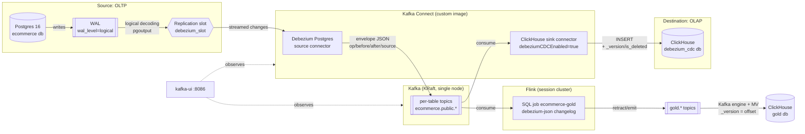

# Real-time CDC: Postgres → Kafka → ClickHouse, with a Flink gold layer

[](https://github.com/salbifaza/stream-debezium-kafka/actions/workflows/smoke.yml)
[](LICENSE)


**Revenue metrics that stay correct through updates, deletes and
cancellations, about 2 seconds behind the source database.**

Most CDC demos stop at "rows show up in the warehouse." This one keeps
going. Debezium streams an e-commerce Postgres database into Kafka. One
consumer mirrors every table into ClickHouse. A second consumer, a Flink
SQL job, maintains daily revenue, revenue per category and customer
lifetime value from the same change stream. `make verify` then recomputes
those numbers in Postgres and requires a row-for-row match after an order
is cancelled, a line item is deleted and a customer changes country.

## Results at a glance

| | |
|---|---|
| **Gold layer freshness** | Postgres `UPDATE` → changed aggregate row in ClickHouse in **1.4–2.5 s** |
| **Gold layer correctness** | All 3 aggregates **identical to Postgres**, row for row, checked on every CI run |
| **Crash safety** | `SIGKILL` on Kafka Connect with 2,000 rows in flight: **0 lost, 0 duplicated**, connectors resumed on their own |
| **Flink recovery** | Gold stayed correct through a killed taskmanager (checkpoint restore) and a cancelled + resubmitted job (full replay) |
| **Schema evolution** | A new source column appears in ClickHouse automatically (`auto.evolve`), with no manual DDL |
| **Least privilege** | The sink writes as a user with `INSERT, SELECT, ALTER ADD COLUMN` on one database. Nothing else. |

## Architecture



- **Silver** (`debezium_cdc.*`): a one-to-one mirror of the six source
  tables, written by the official
  [ClickHouse Kafka Connect sink](https://github.com/ClickHouse/clickhouse-kafka-connect).
- **Gold** (`gold.*`): business aggregates maintained by
  [`flink/sql/gold.sql`](flink/sql/gold.sql).

| Gold table | Grain | What changes it |
|---|---|---|
| `gold.daily_revenue` | order day (UTC) | new and cancelled orders |
| `gold.category_revenue` | category | line items added or deleted, cancelled orders, products recategorised, categories renamed |
| `gold.customer_ltv` | customer | orders, plus the customer's own email and country |

## Run it in 2 commands

Requires Docker Compose v2 and about 5 GB of free RAM.

```bash
make up       # builds images, starts 7 containers, registers connectors, deploys the Flink job
make verify   # row counts, live insert/update/delete, new column, gold vs. Postgres
```

The first run takes a few minutes to pull images and build the custom
Kafka Connect image. A passing run looks like this:

```
== Step 1: row counts, source vs. ClickHouse (FINAL, excluding soft-deletes) ==
  categories     source=5      clickhouse=5      OK
  ...
  payments       source=30     clickhouse=30     OK

== Step 2: live CDC test (insert / update / delete) ==
  insert propagated: yes
  update propagated: yes
  delete propagated (soft-delete tombstone): yes

== Step 3: schema evolution (auto.evolve) -- a new source column reaches ClickHouse ==
  new column propagated: yes (ClickHouse added weight_grams Nullable(Int32), value 95745)

== Step 4: gold layer (Flink) matches the same aggregates computed in Postgres ==
  gold.daily_revenue      22 rows, identical to Postgres  OK
  gold.category_revenue    5 rows, identical to Postgres  OK
  gold.customer_ltv       15 rows, identical to Postgres  OK
  gold converged within ~2s of the last source change.

CDC verification PASSED.
```

Then explore:

```bash
make status   # connector/task + Flink job status, consumer lag, WAL retention, row counts
make logs     # tail all service logs
make down     # stop, keep data
make reset    # stop and wipe everything
```

| UI | URL |
|---|---|
| kafka-ui (topics, lag, connector status) | http://localhost:8086 |
| Flink dashboard | http://localhost:8088 |
| ClickHouse HTTP | http://localhost:8124 |

```sql
SELECT * FROM gold.customer_ltv FINAL ORDER BY lifetime_value_cents DESC;
```

## Three things that broke, and what they taught me

I tested each design assumption against the running stack. Three were
wrong.

### 1. A ClickHouse materialized view gives the wrong revenue on CDC data

The obvious gold layer is a ClickHouse MV. But an MV only sees inserted
rows. On a change stream it counts every update a second time, never
subtracts a delete, and ignores changes on the right-hand side of a join.
Cancel an order, and revenue goes *up*.

Flink reads Debezium topics as a changelog, where each update is a
retraction of the old row plus the new row, so its aggregates and joins
correct themselves. That only works if the update carries the old row,
which meant setting `REPLICA IDENTITY FULL` on the source. Without it,
Flink can't retract an update.
→ [Why not a materialized view](docs/architecture.md#why-not-a-clickhouse-materialized-view)

### 2. `auto.evolve` failed three times before it worked

- **Off:** a new source column is silently dropped. No error, and the
  task stays `RUNNING`. It is easy to miss.
- **On, first try:** the task failed loudly on a missing ClickHouse
  grant. Rows synced before the fix stayed permanently without the new
  column.
- **On, with the grant:** the task failed again. `auto.evolve` checks the
  schema of only the *last* record in a batch, and when that record is a
  Debezium delete tombstone, there is no schema to check. A tombstone
  filter on the sink fixed it.

It is now on by default, and every `make verify` run adds a column to
prove it still works.
→ [Schema evolution, tested both ways](docs/architecture.md#schema-evolution----tested-both-ways-not-assumed)

### 3. A replication slot doesn't drain on an idle database

Pausing the source connector makes Postgres retain WAL, which is
expected. What I didn't expect was that after resuming, the retained WAL
stayed flat for 10 minutes. Two forced `CHECKPOINT`s and Kafka Connect's
offset flush didn't help. It drained instantly the moment one more
trivial write hit the database.

The reason: a logical slot's `restart_lsn` only advances when Postgres
sees a fresh `xl_running_xacts` WAL record. On a quiet source, confirmed
offsets plus checkpoints are not enough. That matters if you alert on
slot size.
→ [WAL retention while paused](docs/architecture.md#wal-retention-while-paused)

**A bonus that went the other way:** I planned a hand-written
transform to flatten Debezium's envelope for ClickHouse. Reading the sink
connector's source showed a native Debezium mode (`debeziumCDCEnabled`)
that consumes the raw envelope and derives `_version` from the WAL LSN.
I deleted the transform from the plan.
→ [Debezium's envelope → ClickHouse](docs/architecture.md#debeziums-envelope---clickhouse-no-hand-rolled-flattening-needed)

## Why Debezium + Kafka?

A purpose-built Postgres → ClickHouse replication tool would be less work
for one source and one sink. I chose to put Kafka in the middle because
the change stream is worth more than any one destination.

| | Gain | Cost |
|---|---|---|
| **Fan-out** | Any number of consumers read the same replayable log | One more system to run (Kafka) |
| **Decoupling** | Source, broker and sink are independently versioned and replaceable | Debugging spans Postgres, Kafka Connect and ClickHouse |
| **Replay** | A new consumer can rebuild its state from the topics | Topic retention has to be sized for it |
| **Schema** | Full control over destination DDL | DDL is hand-written; only `ADD COLUMN` is automatic |

**The proof:** the Flink gold layer was added as a second consumer
without touching the source connector or the ClickHouse sink. A search
index, a cache invalidator or an event-driven service would plug in the
same way.

## What I'd change for production

| Gap | Risk | What I'd do |
|---|---|---|
| No TLS | Plaintext Kafka, ClickHouse and Postgres traffic | TLS + SASL on every listener |
| JSON with embedded schemas | Larger messages, no compatibility checks | Avro + Schema Registry |
| `auto.evolve` covers only added columns | Renames and drops need a manual migration; the sink holds DDL rights | Coordinated migration runbook; schema-drift alerting if `auto.evolve` is turned off |
| Single broker, single Postgres | No HA anywhere | Multi-broker Kafka; Postgres standbys with slot failover |
| No alerting | Lag or slot growth goes unnoticed | Connect status, consumer lag and slot size in Prometheus/Grafana with paging |
| Flink: no HA, unbounded join state | Restart replays every topic; state grows forever | Flink Kubernetes operator + savepoints; `table.exec.state.ttl` or interval joins |
| `REPLICA IDENTITY FULL` | More WAL per update/delete | Size WAL for a write-heavy source |
| Tiny data volumes | Proves correctness, not throughput | Load test; tune partitions, `tasks.max` and ClickHouse merges |

## Under the hood

<details>
<summary><b>Services and ports</b></summary>

| Service | Role | Host port(s) |
|---|---|---|
| `dbz-kafka` | Single-node Kafka, KRaft mode (no ZooKeeper) | `9094` |
| `dbz-kafka-connect` | Debezium Connect image + ClickHouse sink plugin ([`kafka-connect/Dockerfile`](kafka-connect/Dockerfile)) | `8087` (REST) |
| `dbz-kafka-ui` | Topics, lag, connector status | `8086` |
| `dbz-source-postgres` | OLTP source | `5433` |
| `dbz-clickhouse` | OLAP destination (`debezium_cdc`, `gold`) | `8124` (HTTP), `9010` (native) |
| `dbz-flink-jobmanager` / `-taskmanager` | Flink session cluster running the gold job | `8088` |

</details>

<details>
<summary><b>Source and sink configuration</b></summary>

**Postgres** runs with `wal_level=logical` and an explicit publication
([`postgres/init/01_schema.sql`](postgres/init/01_schema.sql)):

```sql
CREATE PUBLICATION dbz_pub FOR TABLE
    categories, customers, products, orders, order_items, payments;
```

`publication.autocreate.mode=disabled` makes Debezium refuse to start,
rather than create a broader publication, if this one is missing.

**ClickHouse:** a bootstrap admin user only provisions a scoped
`clickhouse_etl` user
([`clickhouse/init/01_clickhouse_etl_user.sh`](clickhouse/init/01_clickhouse_etl_user.sh)),
which the sink authenticates as:

```sql
GRANT INSERT, SELECT, ALTER ADD COLUMN ON debezium_cdc.* TO clickhouse_etl;
```

The sink never creates tables. Destination DDL is hand-written in
[`clickhouse/init/02_destination_tables.sql`](clickhouse/init/02_destination_tables.sql).

**Connectors** are checked-in JSON
([`connectors/`](connectors/)), applied idempotently by
`scripts/register_connectors.sh` with a `PUT` to Kafka Connect's REST
API. Credentials are injected from `.env` at registration time.

</details>

<details>
<summary><b>Querying the mirror: always use <code>FINAL</code></b></summary>

Deletes are soft deletes (`is_deleted = 1`), because
`ReplacingMergeTree` can't remove a single row from an existing part.
Query silver tables like this:

```sql
SELECT * FROM debezium_cdc.order_items FINAL WHERE is_deleted = 0;
```

Gold tables use `ReplacingMergeTree(_version, is_deleted)`, so `FINAL`
alone hides retracted rows.
[Why `ReplacingMergeTree`](docs/architecture.md#clickhouse-table-engine-choice-why-replacingmergetree)
compared with `CollapsingMergeTree` and `AggregatingMergeTree`.

</details>

<details>
<summary><b>Repo layout</b></summary>

```
docker-compose.yml        # full stack
Makefile                  # up, verify, status, logs, down, reset
.env.example              # copy to .env to override credentials

kafka-connect/Dockerfile  # Debezium Connect + ClickHouse sink plugin
flink/Dockerfile          # Flink 2.2 + Kafka SQL connector
flink/sql/gold.sql        # Debezium topics -> aggregates -> gold.* topics

postgres/init/            # replication access, schema + publication, seed data
clickhouse/init/          # least-privilege user, silver DDL
clickhouse/gold.sql       # gold tables + Kafka engine consumers

connectors/               # source and sink connector configs
scripts/
  register_connectors.sh  # apply connector configs via REST
  deploy_gold.sh          # gold topics, ClickHouse DDL, Flink job submit
  verify_cdc.sh           # end-to-end verification (also run in CI)
  connector_status.sh     # status, lag, slot size, row counts

docs/architecture.md      # full mechanics and every failure test in detail
```

</details>

**Going deeper:** [`docs/architecture.md`](docs/architecture.md) covers
the mechanics, each failure test with its reproduction commands, and the
Flink job's design.

## License

[MIT](LICENSE)
