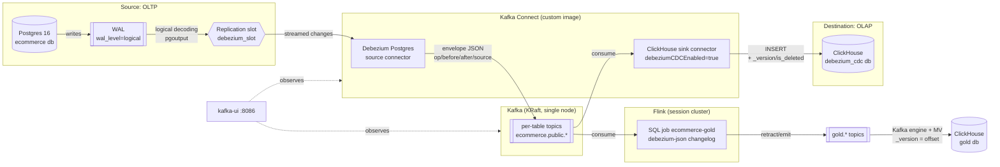

# Architecture

## What this project demonstrates

A change data capture (CDC) pipeline that streams row-level changes from an
OLTP Postgres database into ClickHouse, an OLAP column store, in near
real-time -- via Debezium's Postgres connector, Kafka, and the official
ClickHouse Kafka Connect sink connector, assembled by hand from
general-purpose parts. This is the sibling project to
[`stream-cdc-peerdb`](../../stream-cdc-peerdb), which solves the identical
problem (same schema, same seed data, same ClickHouse destination) using
PeerDB, a single purpose-built product. Same source, same sink -- the only
variable is the CDC middleware, which makes the two repos a genuine
apples-to-apples comparison rather than two unrelated demos.

## Why logical replication instead of polling or triggers

Same mechanism as stream-cdc-peerdb, reused here verbatim because the
reasoning doesn't change with the tool: Debezium's Postgres connector reads
the Write-Ahead Log (WAL) that Postgres already produces for crash
recovery, via the same `pgoutput` logical-decoding plugin PeerDB uses and
Postgres itself uses for logical standby servers. Near-zero overhead on the
source, captures every change including deletes, in commit order, exactly
once per transaction. Nothing proprietary sits inside Postgres in either
project -- both are clients of the same public, versioned protocol.

## The mechanics inside Postgres

Identical configuration to stream-cdc-peerdb (`docker-compose.yml`,
`postgres/init/01_schema.sql`):

1. **`wal_level = logical`** -- required for logical decoding.
2. **A replication slot** (`debezium_slot`) -- created when the Debezium
   source connector starts. Retains WAL the slot hasn't confirmed consuming
   yet, even across a connector restart. See "WAL retention" below for what
   happens when nothing is consuming it.
3. **A publication** (`dbz_pub`) -- created explicitly in
   `01_schema.sql` for the same reason as PeerDB's `peerdb_pub`: an
   explicit table list, not `FOR ALL TABLES`, so a new table added later
   doesn't silently start streaming. `publication.autocreate.mode=disabled`
   in `connectors/pg-source-connector.json` means Debezium refuses to start
   rather than creating its own broader publication if this one is missing
   -- config lives as a checked-in file, not implicit tool behavior.

## Pipeline components and what each one does

Where stream-cdc-peerdb's docker-compose is "PeerDB's real internal
architecture, vendored basically unmodified," this project's compose file
is closer to what it looks like to assemble the same capability from
general-purpose parts:

- **`kafka`** -- a single-node Apache Kafka broker in **KRaft mode**
  (combined broker+controller, no ZooKeeper). Worth naming explicitly: a
  lot of Debezium tutorials still show ZooKeeper, but Kafka itself dropped
  the dependency, and this project uses the current default.
- **`kafka-connect`** -- a *custom-built image* (`kafka-connect/Dockerfile`):
  Debezium's own Connect image (which ships the Postgres source connector)
  plus the official ClickHouse Kafka Connect sink connector, added as a
  second plugin dropped into `$KAFKA_CONNECT_PLUGINS_DIR`. This build step
  -- and the fact that it's a build step at all -- is the literal, concrete
  version of stream-cdc-peerdb README's "four extra systems to assemble"
  claim: PeerDB ships an equivalent source+sink pairing as one coherent
  product; here it's two independently-versioned connectors bolted onto a
  generic runtime by hand.
- **`kafka-ui`** -- one dashboard for topics, consumer lag, and
  connector/task status. The role `temporal-ui` + `peerdb-ui` jointly play
  in stream-cdc-peerdb, here provided by a single third-party tool wired to
  both Kafka and the Connect REST API.
- **`source-postgres`** / **`clickhouse`** -- same roles, same schema, same
  seed data as stream-cdc-peerdb.
- **`flink-jobmanager`** / **`flink-taskmanager`** -- a Flink session
  cluster running one SQL job that computes the gold layer from the same
  Debezium topics the ClickHouse sink reads. It has no counterpart in
  stream-cdc-peerdb, and that's the point: it's a second, independent
  consumer of the change stream, added without touching the source
  connector. See [Streaming gold layer](#streaming-gold-layer-flink).

**No schema registry, no Avro** -- a deliberate, named scope cut (see
"Production considerations" in the README), not an oversight. Both
connectors use JSON converters. The source connector runs with
`value.converter.schemas.enable=true` (the JSON payload embeds its own
schema) rather than `false`, for a specific reason covered next.

## Debezium's envelope -> ClickHouse: no hand-rolled flattening needed

The original design for this project assumed the ClickHouse sink connector
would need a Debezium flattening SMT (`ExtractNewRecordState`) to turn
Debezium's `before`/`after`/`op` envelope into plain rows, the same way a
JDBC or Elasticsearch sink typically does. Checking the connector's actual
source
([`DebeziumRecordConvertor.java`](https://github.com/ClickHouse/clickhouse-kafka-connect/blob/main/src/main/java/com/clickhouse/kafka/connect/sink/data/convert/DebeziumRecordConvertor.java))
showed that's unnecessary: the official ClickHouse Kafka Connect sink has a
**native Debezium CDC mode** (`debeziumCDCEnabled=true`,
`connectors/ch-sink-connector.json`). With it enabled, the connector
consumes Debezium's raw envelope directly and injects two columns per row:

- **`_version`** `UInt64` -- the PostgreSQL WAL LSN the change committed at
  (`source.lsn`), used as the `ReplacingMergeTree` version column. This is
  a genuine improvement over a hand-rolled millisecond timestamp: LSN is
  strictly monotonic per source, so two updates to the same row can never
  tie the way two updates in the same source millisecond could with a
  timestamp-based version. Plays the same role as PeerDB's
  `_peerdb_version`.
- **`is_deleted`** `UInt8` -- 0 for insert/update/snapshot rows, 1 for
  deletes. Plays the same role as PeerDB's `_peerdb_is_deleted` -- same
  query gotcha applies: every read needs `FINAL WHERE is_deleted = 0`.
  Verified directly: `SELECT count(*) FROM order_items FINAL` after a
  delete test overcounts by exactly the deleted row, identically to
  stream-cdc-peerdb's documented gotcha.

This detection requires the sink record to carry a real Kafka Connect
schema whose name ends in `.Envelope` -- which is *why*
`value.converter.schemas.enable=true` is set on both connectors, rather
than the leaner schemaless JSON stream. The cost of skipping a real schema
registry (see above) is paid here: every message on the wire carries its
full embedded schema, a real, measurable size/throughput tradeoff against
Avro+registry that a higher-volume production deployment would want to
reconsider.

## ClickHouse table engine choice: why `ReplacingMergeTree`

Same reasoning as stream-cdc-peerdb's engine-choice section (see that
project's `docs/architecture.md` for the full `MergeTree` vs.
`CollapsingMergeTree` vs. `AggregatingMergeTree` comparison) -- CDC
delivers "here is the new full state of this row," and
`ReplacingMergeTree(_version)` is the engine whose "keep the
highest-versioned row per key" semantics match that directly. Every table
in `clickhouse/init/02_destination_tables.sql` uses it, e.g.:

```sql
CREATE TABLE debezium_cdc.orders
(
    `order_id` Int32,
    `customer_id` Int32,
    `status` LowCardinality(String),
    `order_total_cents` Int32,
    `created_at` DateTime64(6),
    `updated_at` DateTime64(6),
    `_version` UInt64,
    `is_deleted` UInt8 DEFAULT 0
)
ENGINE = ReplacingMergeTree(_version)
ORDER BY order_id
```

**The concrete contrast with PeerDB**: PeerDB generates this DDL
automatically from the source table on `CREATE MIRROR`. Here, every one of
these `CREATE TABLE` statements is hand-written, and the ClickHouse Kafka
Connect sink connector never creates a table that doesn't already exist --
this file has to exist and be correct *before* the connector starts, or the
connector fails outright (`errors.tolerance=none`) rather than improvising
a schema.

## Streaming gold layer (Flink)

`debezium_cdc.*` is a silver layer: one ClickHouse table per source
table, correct when read with `FINAL WHERE is_deleted = 0`. The gold
layer is three business aggregates -- `gold.daily_revenue`,
`gold.category_revenue`, `gold.customer_ltv` -- kept up to date as the
source changes, within a couple of seconds.

### Why not a ClickHouse materialized view

The obvious approach is an incremental ClickHouse MV (e.g. into
`SummingMergeTree`) on top of `debezium_cdc.orders`. It gives wrong
answers on CDC data, because an MV only ever sees each newly-inserted
block:

- An UPDATE arrives as a new row version. The MV adds it again and never
  subtracts the old one, so an order that goes `pending -> paid ->
  shipped` is counted three times.
- A DELETE arrives as a row with `is_deleted = 1`. The MV can't subtract
  it.
- A join in an MV fires only on inserts to its left-hand table. Renaming
  a category or moving a customer to another country doesn't touch any
  gold row already joined.

A refreshable MV (recompute everything every N seconds) is correct but
is batch, not streaming. Flink is the option that's both correct and
incremental.

### How it works

```
ecommerce.public.* ──> Flink SQL job ──> gold.* topics ──> ClickHouse Kafka engine ──> gold.* tables
 (Debezium envelope)    (flink/sql/       (debezium-json)   + MV (clickhouse/gold.sql)   ReplacingMergeTree
                         gold.sql)                                                        (_version, is_deleted)
```

1. **Flink reads the change topics as a changelog.** The `debezium-json`
   format turns each Debezium event into Flink row kinds: snapshot/insert
   -> `+I`, update -> `-U` (old row) and `+U` (new row), delete -> `-D`.
   Aggregates and joins consume the retractions and emit corrected
   results. Cancelling order 1 retracts its revenue from its day, its
   categories, and its customer's lifetime value.
2. **That needs the full old row**, so every source table is
   `REPLICA IDENTITY FULL` (`postgres/init/01_schema.sql`). With the
   default identity, Debezium's `before` is null on UPDATE and only the
   primary key on DELETE. Flink's debezium-json format rejects the
   UPDATE outright (an aggregate can't retract a value it never saw).
   The cost is a larger WAL on updates and deletes.
3. **Flink writes gold back to Kafka as debezium-json, not upsert-kafka.**
   Upsert-kafka represents a delete as a null-value tombstone. The
   ClickHouse Kafka Connect sink maps a null value to a record with no
   fields, never to a delete (`Record.getConvertor` ->
   `EmptyRecordConvertor` in the connector's v1.4.0 source). A tombstone
   also has no body for a Kafka-engine MV to read a key or delete flag
   from. Either way, a gold row that should disappear wouldn't. Flink's
   debezium-json output encodes a delete as
   `{"op":"d","before":{...}}`, which is an ordinary message. (I chose
   this from reading the code and did not test the tombstone path.)
4. **ClickHouse ingests with its Kafka table engine, not a second sink
   connector.** The sink connector's Debezium mode needs a
   *source-connector* envelope: it reads `source.lsn` for `_version`,
   which Flink's output doesn't have. The Kafka engine exposes each
   message's `_offset` instead, and the MV uses it as `_version`. Flink
   partitions each gold topic by the gold row's key (`key.fields`), so
   every change to one row lands in one partition, where offsets are
   strictly increasing. An updated row arrives as `d` then `c`, and the
   `c` has the higher offset, so it wins.
5. **`ReplacingMergeTree(_version, is_deleted)`**, using the engine's
   built-in delete flag rather than a plain column as in `debezium_cdc`.
   `SELECT ... FROM gold.x FINAL` is enough; deleted rows are already
   hidden.

**Gold queries aggregate on the gold row's own key, then join attributes
on.** `customer_ltv` groups orders by `customer_id` and only then joins
email/country. Grouping by `(customer_id, country)` would also be
correct, but it turns a country change into "delete the row under the
old key, insert under the new key". Those are two keys, which at
parallelism > 1 may be processed by different subtasks and reach Kafka
in either order. Keyed this way, every change to a customer's gold row
goes through one subtask, in order.

### Verified against the live stack

`scripts/verify_cdc.sh` Step 4 recomputes each gold table directly in
Postgres with plain SQL and requires ClickHouse's `gold.* FINAL` to
match it row for row, after the Step 2 changes (an order cancelled, an
order item deleted) plus a customer's country toggled.

- **Correctness**: all three gold tables matched Postgres exactly on the
  first run. `daily_revenue` went from 23 to 22 rows, because cancelling
  order 1 left its day with no orders. That's a gold-row delete
  propagating, not only updates.
- **Latency**: a Postgres `UPDATE` showing up in `gold.customer_ltv`
  took 1.4-2.5s across three runs (polling ClickHouse every 100ms). The
  biggest term was ClickHouse's Kafka engine flush interval. At its 7.5s
  default the same check took ~6s, so `clickhouse/gold.sql` sets
  `kafka_flush_interval_ms = 1000`.
- **Taskmanager killed mid-stream** (`docker kill`), then an order
  cancelled and an item deleted while it was down: the job sat in
  `RESTARTING`, and once the taskmanager was started again it restored
  from its last checkpoint and gold matched Postgres within ~2s.
- **Job cancelled and resubmitted** (no savepoint, as after a Flink
  cluster restart): the new job re-read every source topic from the
  start and re-emitted the full gold history. Max `_version` in
  `gold.customer_ltv` went 122 -> 247, and the final state matched
  Postgres, because replayed messages carry newer offsets.

### Limits

- **Flink state grows without bound.** Regular joins keep both sides in
  state forever. Fine for this data size. In production you'd set
  `table.exec.state.ttl` (accepting that very old rows stop being
  retractable) or move to interval/temporal joins where the semantics
  allow.
- **No HA and no savepoints.** A Flink cluster restart loses the job.
  `scripts/deploy_gold.sh` resubmits it, which means a full replay of
  every source topic. That's correct, but at real volumes you'd run the
  Flink Kubernetes operator with HA and restore from savepoints.
- **At-least-once into gold topics.** After a failure, Flink re-emits
  output since the last checkpoint. ClickHouse's offset-as-version makes
  that harmless for the final state, but a consumer of the raw `gold.*`
  topics will see duplicates.
- **Source topics are retained by time** (Kafka's 7-day default), so a
  full replay only works while the full history is still in Kafka.
  Making the Debezium topics compacted, or re-snapshotting, would be
  needed beyond that.

## Data flow diagram



## Failure modes and recovery (tested against this project's live stack)

Same discipline as stream-cdc-peerdb: everything below was run against this
project's own running pipeline, not summarized from documentation.

### Schema evolution -- tested both ways, not assumed

This pipeline now ships with `auto.evolve=true` and the `ALTER ADD
COLUMN` grant it needs; the findings below are what led there, plus one
more that only showed up once it was the default.

**With `auto.evolve=false` (the original default)**: adding a
column on the source (`ALTER TABLE products ADD COLUMN weight_grams
INTEGER`) followed by an `UPDATE` did **not** error, did **not** appear in
any log as a warning, and did **not** fail the connector task
(`errors.tolerance=none` never triggered, because the sink connector
doesn't treat an unrecognized field as an error -- it's just not written
anywhere). The row's other columns updated correctly; `weight_grams` was
silently and permanently dropped for that row. This is a different failure
shape than PeerDB's: PeerDB's `ReplacingMergeTree` replaces the *whole*
row, so a source-side rename/drop blanks *existing* columns on the next
update (active corruption). Here, an *added* column is just never
persisted anywhere -- no existing data is corrupted, but the new column's
data is gone the moment its message is consumed, with nothing to indicate
that happened.

**With `auto.evolve=true`**: the sink connector genuinely does what PeerDB
does automatically -- it detected the unrecognized field and ran `ALTER
TABLE products ADD COLUMN IF NOT EXISTS weight_grams Nullable(Int32)`
against ClickHouse itself. First attempt **failed loudly** (task went to
`FAILED`, `errors.tolerance=none` did its job) with:

```
DB::Exception: clickhouse_etl: Not enough privileges. To execute this
query, it's necessary to have the grant ALTER ADD COLUMN(weight_grams)
ON debezium_cdc.products. (ACCESS_DENIED)
```

-- because `clickhouse/init/01_clickhouse_etl_user.sh`'s grant set
(`INSERT, SELECT` only) deliberately doesn't include `ALTER ADD COLUMN`,
matching `auto.evolve=false`'s default. Granting `ALTER ADD COLUMN ON
debezium_cdc.*` and restarting the task made it succeed: the column was
added with the correct inferred type, and the row that had been dropped
under `auto.evolve=false` earlier stayed permanently `NULL` -- enabling
auto-evolution later does **not** retroactively recover data silently
dropped before it was turned on; that Kafka message was already consumed
and committed. A genuinely close parallel to PeerDB, which also needs an
explicit `ALTER ADD COLUMN` grant for its own automatic schema evolution
(see stream-cdc-peerdb's ClickHouse configuration section) -- the real
difference isn't capability, it's default-off vs. default-on, and a hard,
loud failure instead of PeerDB's silent one when the grant is missing.

**With `auto.evolve=true`, Debezium's delete tombstones kill the sink
task.** Found when `auto.evolve=true` became the default and
`verify_cdc.sh` ran its delete with it on, which the original experiment
never did. After every DELETE, Debezium writes a second message with the
same key and a null value (a tombstone, so log compaction can drop the
key). The task failed on the first delete with:

```
auto.evolve requires a Connect schema (Avro, Protobuf, or JSON Schema).
Schemaless or string records are not supported with auto.evolve=true.
```

The cause, in the connector's v1.4.0 source (`ClickHouseWriter.java`):
with `auto.evolve` on, it reads the field list of only the **last**
record in each batch and throws if it's empty. A tombstone has no
fields, so any batch that happens to end on one fails. Whether a given
delete triggers it depends on where the batch boundary falls. The fix,
in `connectors/ch-sink-connector.json`, is Kafka Connect's built-in
`Filter` transform with the `RecordIsTombstone` predicate, which drops
tombstones before the sink sees them. Nothing is lost: the Debezium
delete event right before the tombstone is what sets `is_deleted = 1`.
Filtering in the sink rather than setting `tombstones.on.delete=false`
on the source leaves the topics unchanged for other consumers (Flink
already skips tombstones).

The same code comment names a second limitation: only the last record's
schema is checked. If one batch contains a column's first appearance
followed by a record without it, the column isn't added for that batch.
In practice it's added on the next batch, because every later message
for that table carries the column.

**Practical takeaway**: this connector *can* match PeerDB's automatic
`ADD COLUMN` behavior, but only with all three: `auto.evolve=true`, the
`ALTER ADD COLUMN` grant, and tombstones filtered out. None of those are
defaults. `verify_cdc.sh` Step 3 now checks it on every run: it adds
`products.weight_grams` in Postgres and requires the column (created as
`Nullable(Int32)`) and its value to show up in ClickHouse. It still only
covers *added* columns. A rename or drop on the source is not
propagated and needs a coordinated migration.

### Worker crash mid-batch

Killing `kafka-connect` (`docker kill -s SIGKILL dbz-kafka-connect`)
immediately after issuing a 2,000-row insert, then bringing the container
back up:

- **The row count landed at exactly 2,006 (6 pre-existing + 2,000 new) --
  no loss, no duplicates** (`uniqExact(category_id)` matched `count()`
  exactly). Same guarantee as PeerDB's Temporal-checkpoint recovery, via a
  different mechanism here: Kafka Connect's distributed-mode offsets
  (stored in Kafka's own internal `_connect-offsets` topic) and Debezium's
  own replication-slot LSN checkpointing together mean a restarted worker
  resumes from the last confirmed position rather than reprocessing or
  skipping.
- **Both connectors resumed automatically without re-registration.**
  Unlike PeerDB (where a mirror is defined once via `CREATE MIRROR` and
  lives in PeerDB's own catalog), Kafka Connect's distributed-mode
  connector *configs* also live in a Kafka-backed topic
  (`_connect-configs`), so a freshly-started worker rejoining the cluster
  picks up and restarts previously-registered connectors on its own --
  `scripts/register_connectors.sh` only needs to run once, ever, not after
  every restart.
- **`restart: unless-stopped` did not bring the container back
  automatically** -- identical Docker behavior to stream-cdc-peerdb's
  finding, for the identical reason: `docker kill` is treated as
  intentional operator action, not a crash, so the restart policy never
  fires. Confirmed directly: `docker compose ps -a` showed
  `Exited (137)` and stayed there until manually brought back up with
  `docker compose up -d kafka-connect`. A real deployment needs an
  orchestrator's liveness probe for this, in either project.

### WAL retention while paused

`PUT /connectors/ecommerce-pg-source/pause` (Kafka Connect REST API) stops
the source connector from consuming further, while writes on
`source-postgres` continue normally -- Postgres doesn't know or care that
the downstream consumer paused, so the replication slot retains WAL it
hasn't confirmed, the same physical mechanism stream-cdc-peerdb
demonstrated for PeerDB. Measured directly against `debezium_slot`:
inserting 500 rows while paused grew retained WAL from ~506 kB to ~629 kB.

**A subtlety worth naming in full, not glossed over**: after resuming the
connector, `restart_lsn` (the value `pg_replication_slots` reports, and
the value that actually bounds retained WAL) did **not** shrink -- at all
-- for a full 10 minutes, across two explicit `CHECKPOINT` commands, well
past Kafka Connect's default 60-second offset-flush interval, even though
`pg_stat_replication.flush_lsn` had already advanced close to current and
`pg_stat_activity` showed no other open transaction that could be pinning
it. Retained WAL only dropped (629 kB → 17 kB, instantly) after issuing
**one more trivial write** (`INSERT` + `DELETE` of a single throwaway row)
followed by a `CHECKPOINT`.

The mechanism: a logical replication slot's `restart_lsn` doesn't advance
directly to "wherever the consumer last confirmed" -- Postgres computes a
*candidate* restart position from `xl_running_xacts` WAL records (periodic
snapshots of in-flight transactions), and only promotes `restart_lsn` to a
candidate at or below the confirmed position at the next checkpoint. On an
otherwise-idle source, no new `xl_running_xacts` record gets logged, so no
new candidate exists for the slot to advance to -- confirmation and
checkpoints alone aren't sufficient. **Practical takeaway, and it cuts
against the intuitive assumption**: on a quiet source, a paused-then-resumed
connector's reported retained WAL can stay elevated indefinitely, not
because anything is wrong, but because nothing is happening to let Postgres
compute a new restart point -- the fix in production isn't "wait
longer," it's "don't assume retained-WAL size alone means the consumer is
behind" (cross-check `pg_stat_replication.flush_lag`, which reflects the
real confirmed position, alongside slot size). On a real production source
with continuous write traffic this resolves itself automatically; this
finding only surfaces on a low-traffic or idle source, which is exactly
this project's synthetic seed-data workload -- a good example of a
finding that's real but scale/traffic-dependent, not universal.

## What to say in an interview

*"Debezium turns Postgres's own logical replication WAL stream into
Kafka topics; Kafka Connect's distributed-mode offsets give it
restart-safe checkpointing, and the ClickHouse sink connector's native
Debezium mode turns the raw before/after/op envelope into
ReplacingMergeTree-compatible rows without a hand-written flattening
transform."* The failure-injection results above -- schema drift silently
dropping new fields unless you both opt into and grant privileges for
auto-evolution, a killed worker recovering with exact integrity but not
via Docker's own restart policy, and a paused connector's WAL footprint
draining on a slower and less predictable schedule than expected -- are
what distinguish this from a "we stood up Debezium and it worked" claim.
Every number above was reproduced against this project's own running
stack, not asserted from documentation, and where a design assumption
turned out to be wrong (the flattening SMT, the checkpoint-triggers-drain
assumption), it's documented as found, not silently corrected out of the
history.
